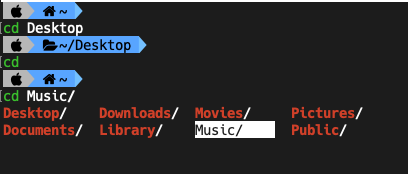

# Custom Terminal



#### Install zsh 
```
brew install zsh
```
#### Open Bash
```
open ~/.bash_profile
```
#### Paste to run zsh in Bash
```
zsh
```
#### To open zsh profile
```
open .zshrc
```

#

#### Install oh-my-zsh
```
sh -c "$(curl -fsSL https://raw.githubusercontent.com/robbyrussell/oh-my-zsh/master/tools/install.sh)"
```

#### Install powerlevel9k in oh-my-zsh
```
git clone https://github.com/bhilburn/powerlevel9k.git ~/.oh-my-zsh/custom/themes/powerlevel9k
```
#### Install zsh-syntax-highlighting in oh-my-zsh
```
git clone https://github.com/zsh-users/zsh-syntax-highlighting.git ~/.oh-my-zsh/custom/plugins
```

#### Install font-hack-nerd-font
First get the homebrew tap
```
brew tap homebrew/cask-fonts
```
Then install font-hack-nerd-font via brew
```
brew cask install font-hack-nerd-font
```
</br>
</br>
</br>

## Edit zsh profile file

#### Change theme
```
ZSH_THEME="powerlevel9k/powerlevel9k"
```
#### Edit plugins
```
plugins=(
git
zsh-syntax-highlighting
)
```
#### Add to customise the Powerlevel9k
### ⚠ Paste before "source $ZSH/oh-my-zsh.sh"
```
# Customise the Powerlevel9k prompts

POWERLEVEL9K_LEFT_PROMPT_ELEMENTS=(

  root_indicator 
  os_icon 
  dir 
  vcs 
  
  )

POWERLEVEL9K_RIGHT_PROMPT_ELEMENTS=(

virtualenv
anaconda
pyenv
nodeenv
nvm
chruby
rbenv
rspec_stats
rvm
aws_eb_env
docker_machine

)

POWERLEVEL9K_ROOT_ICON="sudo"

POWERLEVEL9K_OS_ICON_BACKGROUND="white"
POWERLEVEL9K_OS_ICON_FOREGROUND="black"

# icon start with '\u....'
#POWERLEVEL9K_LEFT_SEGMENT_SEPARATOR='\ue0c0'
#POWERLEVEL9K_RIGHT_SEGMENT_SEPARATOR='\uE0B6'


POWERLEVEL9K_PROMPT_ON_NEWLINE=true
POWERLEVEL9K_STATUS_VERBOSE=false

POWERLEVEL9K_MULTILINE_FIRST_PROMPT_PREFIX=""
POWERLEVEL9K_MULTILINE_LAST_PROMPT_PREFIX=""

# Add the custom apple icon prompt segment
# POWERLEVEL9K_CUSTOM_APPLELOGO="echo -n $'\ufc23'"

# Load Nerd Fonts with Powerlevel9k theme for Zsh
POWERLEVEL9K_MODE='nerdfont-complete'

```
</br>


### Set terminal font to "Hack Nerd Font"

## <center>Have fun</center>

</br>


###  VS Code settings
```
{
"terminal.integrated.fontFamily": "Hack Nerd Font",
}
```
